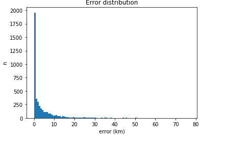

# GEO ML

## Autoencoder
* approach is based on this paper: https://www.researchgate.net/profile/Julian_Szymanski/publication/319562213_Analysis_of_Denoising_Autoencoder_Properties_Through_Misspelling_Correction_Task/links/5a5c88620f7e9b5fb38d3065/Analysis-of-Denoising-Autoencoder-Properties-Through-Misspelling-Correction-Task.pdf
* transform string to fixed length vector
* For example addr_street is autoencoded to 1 dimension from 31 dimensions
* please review autoencoder-2 file

## Next steps
* implement autoencoder for all strings
* use autoencoders to transform categorical features to numerical in a first step
* train NN with numerical features
* benchmark results

## How to set it up
* https://www.docker.com/ (works for Windows, Mac and Linux)
* docker run -it -p 8888:8888 tensorflow/tensorflow
* go to localhost:8888 in your browser
* upload tensorflow2.ipynb within browser
* upload datamerge.csv within browser
* start to run tests in notebook

## Results
### tensorflow2 (address, zip, city)
* 4292 test cases (addresses)
* test method leave one out (test: 1, train: n-1 for 4292 cases)
* remove errors > 1200 (n=9)
* error in km (haversine): 3.93 +- 6.8
* distribution plot:
* 
* [raw data](errors.csv)
* worst 100: [12519.350290369724, 12518.983425620849, 12515.755771434253, 12507.042881039595, 12507.042881039595, 12501.349112567628, 12497.695426069684, 12497.68839985347, 12497.68839985347, 76.83880698581139, 62.6716436373722, 61.05444496449246, 53.74388599639689, 50.62724678874486, 50.480372234561095, 50.480372234561095, 50.07976445393008, 47.66232886710176, 47.652777214133266, 46.60194258720958, 46.432477491229506, 46.098168065089, 45.4977604726335, 45.485818884177625, 44.53730518913435, 44.14553707555925, 44.140321583454174, 42.83006384535046, 42.52055789761058, 41.44414288933017, 40.44108751132422, 38.46743057077099, 38.39631248754222, 38.38920171937243, 38.32798056153578, 38.32798056153578, 38.00967195276218, 37.16631292486895, 37.02311934535388, 36.81410937296348, 36.118481626487295, 36.0512523979998, 35.67616327517528, 35.38822649761279, 35.36446995264358, 35.30420072496577, 35.229724197608775, 35.17106481509366, 34.9365499059433, 34.9155513022647, 34.82846004513275, 34.53470789291049, 33.373663684305384, 33.33852149887754, 33.15957110228941, 33.13896723763183, 32.33683212949709, 32.11536475649671, 32.11536475649671, 30.4023812817652, 30.252165128987382, 30.181623181973148, 30.181623181973148, 29.91309424732569, 29.91309424732569, 29.715651531309387, 29.715651531309387, 29.679547414884485, 29.160043051584477, 29.15781585392679, 28.788676331429727, 28.752595631711912, 28.577454407717962, 28.51082416133847, 28.51082416133847, 28.418969844092832, 28.418969844092832, 27.887390442170314, 27.85441419099296, 26.949843219398407, 26.933750317392953, 26.91773345595074, 26.543960232946393, 26.377673995528212, 26.32114572173431, 26.314308193394954, 26.314308193394954, 26.210013721533024, 26.13362708291256, 26.09278300264816, 26.07113264260859, 26.037372739795774, 26.037372739795774, 26.01629998014282, 25.876985412222734, 25.791412941713947, 25.738355265591768, 25.513358621177133, 25.470569519263613, 25.192498026039964]

### tensorflow3 (plus mappage, maprow, mapcity)
* 4292 test cases (addresses)
* test method leave one out (test: 1, train: n-1 for 4292 cases)
* error in km (haversine): 3.91 +- 6.8
* [raw data](errors-tensorflow3.csv)

### tensorflow4 (plus remaining features)
* 4292 test cases (addresses)
* test method leave one out (test: 1, train: n-1 for 4292 cases)
* error in km (haversine): 4.3 +- 7.54
* [raw data](errors-tensorflow4.csv)

## What I have done so far

* merge test data using references and input (testprepare file)
* draft tensorflow (sklearn file)
* draft sklearn (tensorflow file)
* error report for tensorflow2
* tensorflow3 add mappage, col and row
* tensorflow4 has a model with all requested features
* validate tensorflow3 + error report
* validate tensorflow4 + error report
* batch mode to use model for new data input

